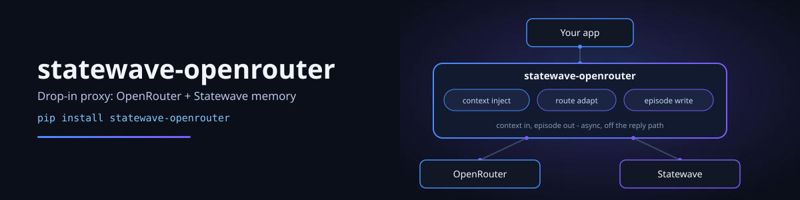
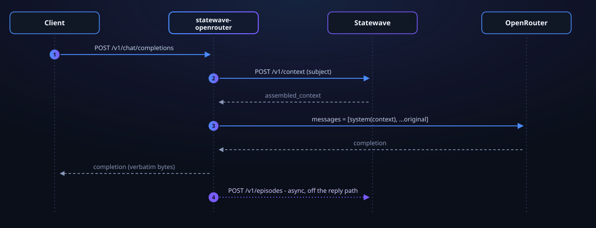

# statewave-openrouter

<p align="center">
  
</p>

<p align="center">
  <a href="https://github.com/smaramwbc/statewave-openrouter/actions/workflows/ci.yml"></a>
  <a href="LICENSE"></a>
  <a href="https://www.python.org/"></a>
  <a href="CHANGELOG.md"></a>
</p>

Point your existing OpenAI client at this proxy, add one header, and the model
remembers - no subject header means plain pass-through, so memory is opt-in
per request, not a global mode.

| | |
| --- | --- |
| **Before** the call | assembles a Statewave context bundle for the subject, injects it into the request |
| **After** the reply | writes the turn back to Statewave as an episode, so the next call knows about this one |

> **Part of the Statewave ecosystem:** [Server](https://github.com/smaramwbc/statewave) · [Python SDK](https://github.com/smaramwbc/statewave-py) · [TypeScript SDK](https://github.com/smaramwbc/statewave-ts) · [Docs](https://github.com/smaramwbc/statewave-docs) · [Website](https://statewave.ai)
> 📋 Issues & feature requests are tracked centrally on [`smaramwbc/statewave`](https://github.com/smaramwbc/statewave/issues).

<details open>
<summary><b>Contents</b></summary>

- [Quick start](#quick-start) - install, configure, run, verify
- [Use it from your app](#use-it-from-your-app)
- [How a request flows](#how-a-request-flows)
- [Memory-aware endpoints](#memory-aware-endpoints)
- [Naming the subject](#naming-the-subject)
- [Authenticating the subject](#authenticating-the-subject) - **read this before deploying**
- [Configuration](#configuration)
- [Requires Statewave 1.0.0+](#requires-statewave-100)
- [Failure behaviour](#failure-behaviour)
- [Troubleshooting](#troubleshooting)
- [Development](#development)

</details>

---

## Quick start

**You need**

| | |
| --- | --- |
| Python **3.11+** | or Docker, if you'd rather not install Python |
| A **Statewave server**, 1.0.0 or newer | reachable from the proxy - see [statewave](https://github.com/smaramwbc/statewave) |
| An **OpenRouter API key** | from [openrouter.ai/keys](https://openrouter.ai/keys) |

### 1. Install

From a clone of this repository:

```bash
pip install .
```

Once v1.0.0 is published, `pip install statewave-openrouter` and the container
image below will work without cloning.

### 2. Configure

```bash
cp .env.example .env
```

`.env.example` documents every variable. Three of them decide whether the proxy
works at all:

| Variable | Set it to |
| --- | --- |
| `OPENROUTER_API_KEY` | Your OpenRouter key. Only used when the caller sends no `Authorization` header of its own. |
| `STATEWAVE_URL` | Where your Statewave server is. Defaults to `http://localhost:8000`. |
| `STATEWAVE_TRUST_CLIENT_SUBJECT=1` **or** `PROXY_JWT_SECRET=...` | How the proxy decides which subject a request may touch. **Pick one** - see [Authenticating the subject](#authenticating-the-subject). |

> [!NOTE]
> Set neither of the last two, and any request naming a subject gets
> `400 statewave_untrusted_subject`. That's deliberate - an open port that
> trusts a header lets anyone read and write anyone's memory. On a laptop or
> private network, `STATEWAVE_TRUST_CLIENT_SUBJECT=1` is the right answer.

### 3. Run

```bash
uvicorn statewave_openrouter:app --env-file .env --port 8080
```

> [!IMPORTANT]
> `--env-file` is not optional. The proxy reads plain environment variables
> and does not load `.env` by itself. Leave the flag off and it starts with
> defaults - no OpenRouter key, Statewave assumed on `localhost:8000` - and the
> failures look like configuration you *did* set being ignored.

<details>
<summary><b>Docker instead</b></summary>

```bash
docker build -t statewave-openrouter .
docker run --rm -p 8080:8080 --env-file .env statewave-openrouter
```

The container listens on `$PORT` (8080 by default) and runs as `nobody`. Once
v1.0.0 is published you can skip the build:

```bash
docker run --rm -p 8080:8080 --env-file .env \
  ghcr.io/smaramwbc/statewave-openrouter:1.0.0
```

Note that `localhost` inside a container is the container. If Statewave runs
on your host, use `STATEWAVE_URL=http://host.docker.internal:8000`. On Docker
for Linux that name does not resolve on its own, so add
`--add-host=host.docker.internal:host-gateway` to the `docker run`.
</details>

### 4. Verify

```bash
curl http://localhost:8080/health
# {"status":"ok"}
```

Then a real call - this one goes to OpenRouter *and* through Statewave.

If you chose `STATEWAVE_TRUST_CLIENT_SUBJECT=1`:

```bash
curl http://localhost:8080/v1/chat/completions \
  -H "Content-Type: application/json" \
  -H "X-Statewave-Subject: user:42" \
  -d '{"model":"openai/gpt-4o","messages":[{"role":"user","content":"What coffee do I like?"}]}'
```

If you chose `PROXY_JWT_SECRET`, the subject comes from a token instead, so use
the call in [Authenticating the subject](#authenticating-the-subject). Sending
`X-Statewave-Subject` on its own gets you `401 statewave_auth_required`.

You should see a normal OpenAI-shaped response. Watch the proxy's log: a
warning there means Statewave was skipped for that turn and the completion went
through without memory - see [Failure behaviour](#failure-behaviour).

---

## Use it from your app

Any OpenAI-compatible client works. Change the base URL, add one header:

```python
from openai import OpenAI

client = OpenAI(base_url="http://localhost:8080/v1", api_key="sk-or-...")

client.chat.completions.create(
    model="openai/gpt-4o",
    messages=[{"role": "user", "content": "What coffee do I like?"}],
    extra_headers={"X-Statewave-Subject": "user:42"},
)
```

Streaming needs no special handling - `stream=True` works as usual.

### What the memory buys you

The call above can answer that question because of one that came days
earlier, in a different process, with nothing keeping the history but
Statewave:

```python
# Monday. A throwaway script - the messages list dies with it.
client.chat.completions.create(
    model="openai/gpt-4o",
    messages=[{"role": "user", "content": "I drink oat flat whites, never dairy."}],
    extra_headers={"X-Statewave-Subject": "user:42"},
)

# Friday. Different process, empty history, same subject.
client.chat.completions.create(
    model="openai/gpt-4o",
    messages=[{"role": "user", "content": "What coffee do I like?"}],
    extra_headers={"X-Statewave-Subject": "user:42"},
)
```

Friday's reply knows about Monday: *"Oat flat whites, and you avoid dairy."*
Drop the `X-Statewave-Subject` header and the same call says it has no idea -
no subject means no context fetched and no episode written, so the two calls
are strangers. That header is the whole difference.

> [!NOTE]
> Replies above are illustrative. The wording is the model's; what the proxy
> guarantees is that Monday's turn is in the context Friday's call is given.

---

## How a request flows

<p align="center">
  
</p>

Three things worth knowing about that last step and the streaming case:

- The episode write is fire-and-forget - it never adds latency to the
  completion.
- **Streaming** works the same way: SSE chunks are relayed byte-for-byte as
  they arrive, and the reply is reassembled line by line so a long stream
  costs the reply text, not a second copy of the body. The episode is written
  once the stream closes.
- An empty reply writes no episode, streamed or not - a turn with no answer in
  it is noise in the subject's memory, not history.

---

## Memory-aware endpoints

Three endpoints get memory. They differ only in where the bundle can go:

| Endpoint | Context bundle goes | Reply read from |
| --- | --- | --- |
| `POST /v1/chat/completions` | a `system` message, first in `messages` | `choices[].message.content` |
| `POST /v1/completions` | ahead of `prompt` | `choices[].text` |
| `POST /v1/responses` | ahead of `instructions`; `input` is untouched | `output[].content[].text` |

Every other path (`/v1/models`, `/v1/credits` and the rest) is proxied straight to
OpenRouter, so the proxy is a drop-in base URL replacement.

---

## Naming the subject

A **subject** is who the memory belongs to (`user:42`, `team:acme`). A
**session** is optional and scopes a run of turns within that subject.

| Where | Subject | Session (optional) |
| --- | --- | --- |
| Header | `X-Statewave-Subject: user:42` | `X-Statewave-Session: sess_abc` |
| Body field | `"statewave_subject": "user:42"` | `"statewave_session": "sess_abc"` |

The header wins if both are present. Body fields are stripped before the
request reaches OpenRouter.

Ids are **1-256 characters** of letters, digits, underscore, dot, dash or
colon, with no `/` and no whitespace. Anything else is rejected with `400
statewave_bad_request` by the proxy, before any upstream call.

**Multi-tenant Statewave, three ways to pick the tenant** - first match wins:

| # | Source | When it applies |
| --- | --- | --- |
| 1 | `STATEWAVE_TENANT_ID` (pinned) | Always wins, over everything below |
| 2 | `tenant` claim on the verified JWT | `PROXY_JWT_SECRET` set, nothing pinned - no claim means no tenant, never a fallback to the header |
| 3 | `X-Tenant-ID` header | No pin, no JWT mode - single-tenant deploys or a self-authing gateway |

> [!WARNING]
> **The tenant is part of the memory's identity.** A turn written under one
> tenant is read back only under that same tenant. Changing
> `STATEWAVE_TENANT_ID` on a running deployment - or adding it where there was
> none - can make existing memory look empty: no error, just an empty bundle.
> Pick a tenant before you have memory worth keeping, then leave it alone.
>
> Statewave applies a tenant's own config (e.g. `require_caller_identity`)
> only to requests that name that tenant. On the server we tested, an
> anonymous read carrying `X-Tenant-ID` got `401`, and the identical read with
> no tenant went through. If you rely on that setting, pin
> `STATEWAVE_TENANT_ID` so every retrieval is bound to it.

---

## Authenticating the subject

Whoever can name a subject can read and write that subject's memory. Choose how
the proxy decides:

| Set | Effect | Use when |
| --- | --- | --- |
| *nothing* | A request carrying a subject gets `400 statewave_untrusted_subject`. Subject-less pass-through still works. | Never intentionally - this is the safe default, not a mode. |
| `STATEWAVE_TRUST_CLIENT_SUBJECT=1` | `X-Statewave-Subject` is trusted as sent. | Laptop, private network, or behind a gateway that already authenticates callers. |
| `PROXY_JWT_SECRET=<hs256 secret>` | Every route but `/health` must send `X-Statewave-Token: <jwt>` signed with that secret. The subject is the token's `sub` claim; `X-Statewave-Subject` is ignored. Missing or bad token → `401`. | Anything reachable by clients you do not control. |

Setting **both** keeps token verification on while letting a trusted gateway
choose the subject per request - it authenticates itself with a token, then
names whichever subject it is acting for.

> [!WARNING]
> In this mode any valid token can name any subject. Tokens MUST be minted by
> that gateway and never handed to end users - an end-user token here is a key
> to every subject's memory.

```bash
# The proxy reads the secret from .env; this shell has to know it too.
export PROXY_JWT_SECRET='the same secret you put in .env'

TOKEN=$(python -c "import jwt; print(jwt.encode({'sub':'user:42'}, '$PROXY_JWT_SECRET', algorithm='HS256'))")

curl http://localhost:8080/v1/chat/completions \
  -H "Content-Type: application/json" \
  -H "X-Statewave-Token: $TOKEN" \
  -d '{"model":"openai/gpt-4o","messages":[{"role":"user","content":"What coffee do I like?"}]}'
```

Tokens must carry an `exp` claim - one without it is rejected, so a leaked
token cannot be valid forever. The proxy verifies tokens; it does not mint,
rotate or revoke them. Your issuer does that.

---

## Configuration

Everything is environment variables. `.env.example` is the annotated copy.

**OpenRouter**

| Variable | Default | Purpose |
| --- | --- | --- |
| `OPENROUTER_API_KEY` | - | Fallback key, used only when the caller sends no `Authorization` header |
| `OPENROUTER_BASE_URL` | `https://openrouter.ai/api/v1` | Upstream |
| `OPENROUTER_SITE_URL` / `OPENROUTER_SITE_NAME` | - | OpenRouter attribution (`HTTP-Referer` / `X-Title`) |

**Statewave**

| Variable | Default | Purpose |
| --- | --- | --- |
| `STATEWAVE_URL` | `http://localhost:8000` | Statewave server |
| `STATEWAVE_API_KEY` | - | Sent as `X-API-Key` |
| `STATEWAVE_TENANT_ID` | - | Pinned tenant; when set, overrides any client `X-Tenant-ID` header |
| `STATEWAVE_CONTEXT_TOKENS` | `1500` | Token budget for the injected bundle |
| `STATEWAVE_COMPILE_AFTER_TURN` | off | Kick an async compile after each turn |
| `STATEWAVE_EPISODE_SOURCE` | `openrouter-proxy` | `source` recorded on written episodes |
| `STATEWAVE_CALLER_TYPE` | `openrouter-gateway` | Caller class Statewave policy rules match on |
| `STATEWAVE_CALLER_ID` | = `STATEWAVE_CALLER_TYPE` | Caller identity sent on every retrieval |

**Proxy**

| Variable | Default | Purpose |
| --- | --- | --- |
| `PROXY_JWT_SECRET` | - | HS256 secret; when set, every completion call needs a valid `X-Statewave-Token` and the subject is its `sub` claim |
| `STATEWAVE_TRUST_CLIENT_SUBJECT` | off | Trust the `X-Statewave-Subject` header (see [Authenticating the subject](#authenticating-the-subject)) |
| `PROXY_TIMEOUT` | `120` | Upstream request timeout in seconds (connect timeout is fixed at 10) |
| `PORT` | `8080` | Container only - the port uvicorn binds inside the image |

---

## Requires Statewave 1.0.0+

Caller identity (`caller_id` / `caller_type`) landed in Statewave v0.9.0; v1.0.0
is the first release where the tenant-config surface is complete. On a tenant
with `require_caller_identity`, a retrieval without those fields is a `401`; on
one in `policy_mode: enforce`, an absent `caller_type` is the least-privileged
caller and quietly thins the bundle. The proxy always sends both.

On startup it pings `GET {STATEWAVE_URL}/v1/version` and logs a warning if the
reported `version` is below 1.0.0. Best-effort: a server that does not expose
the endpoint or the field just boots without the warning.

---

## Failure behaviour

**Statewave is an enhancement, never a hard dependency.** If context assembly or
the episode write fails - server down, wrong key, timeout - it is logged and the
completion still goes through, just without memory for that turn. A Statewave
outage degrades your app's quality; it does not take it down.

On shutdown, in-flight episode writes are drained before the HTTP client
closes, since that is the only place a turn exists before Statewave has it.

---

## Troubleshooting

| Symptom | Cause | Fix |
| --- | --- | --- |
| `400 statewave_untrusted_subject` | Neither trust mode is configured | Set `STATEWAVE_TRUST_CLIENT_SUBJECT=1`, or `PROXY_JWT_SECRET` and send a token |
| `401 statewave_auth_required` | `PROXY_JWT_SECRET` is set, no `X-Statewave-Token` sent | Send the token header - note it is *not* `Authorization` |
| `401 statewave_bad_token` | Token signature, algorithm, or `exp` problem - expired, or no `exp` claim at all | Sign with HS256 using exactly the configured secret, and always set `exp` |
| `400 statewave_bad_request` | Subject or session id has illegal characters | 1-256 chars of letters, digits, `_ . - :` - no `/`, no spaces |
| Replies work but carry no memory, no error | The turn ran without Statewave, by design | Check the proxy log for a warning; verify `STATEWAVE_URL` and that the subject has compiled memories |
| Memory went empty after a config change | Memories are scoped per tenant, and the tenant changed | Put `STATEWAVE_TENANT_ID` back to what it was, or leave it unset if it always was. The same subject under a different tenant is a different memory |
| Config you set appears ignored | `.env` is not read automatically | Start with `uvicorn ... --env-file .env`, or export the variables |
| Log: `statewave rejected the gateway (401)` | Statewave refused the proxy itself | Check `STATEWAVE_API_KEY`, and `STATEWAVE_CALLER_ID` / `STATEWAVE_CALLER_TYPE` on tenants requiring caller identity |
| Container cannot reach Statewave | `localhost` inside a container is the container | `STATEWAVE_URL=http://host.docker.internal:8000` |

---

## Development

```bash
pip install -e ".[dev]"
pytest          # both upstreams faked with httpx MockTransport
ruff check .
```

The whole proxy is one file, `statewave_openrouter.py`. Requirements and their
status live in [REQUIREMENTS.md](REQUIREMENTS.md); release history is in
[CHANGELOG.md](CHANGELOG.md).

---

## License

Apache-2.0. See [LICENSE](LICENSE).
